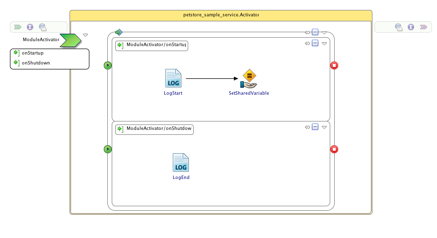
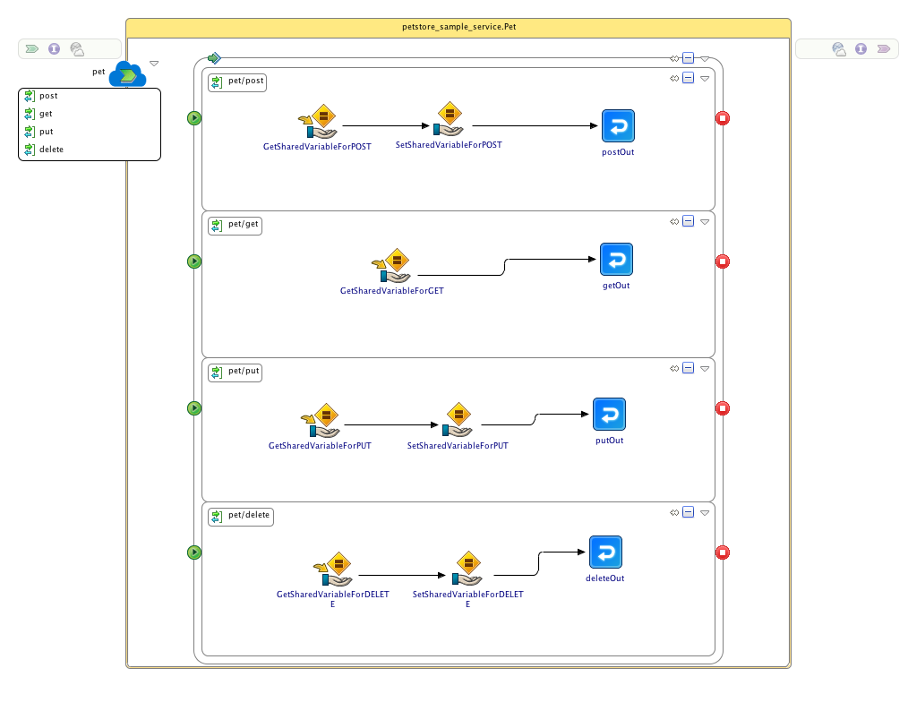

# TIBCO Cloud Integration Petstore Sample
## Synopsis
This project is the petstore sample that can be used with TIBCO Cloud Integration.

## Process Diagram
There are two processes in this project. The first process is called `Activator.bwp` and is executed when the engine starts or stops. In this case it will log a message and set a variable that is used in the other process when the engine starts and logs a messages when the engine stops.

The second process is called `Pet.bwp` and serves as the main process for this sample. For each of the four HTTP verbs (GET, POST, PUT and DELETE) there is a matching operation. For example, when you call the GET operation the pet/get swimlane will be executed and will return all pets that are currently stored. As this process makes use of the internal memory to store pets you can add new pets and delete old ones by invoking the operations. Please note that when you scale down the application to 0 (stop the application) it will no longer remember any changes you have made to the number of pets.

## Installation
Download or clone this repository onto your local machine and import the projects into an existing TIBCO Business Studio - Cloud Edition workspace.

## Deployment
There are two options to run this application. You can either debug this application using TIBCO Business Studio - Cloud Edition or deploy this application to the TIBCO Cloud Integration runtime.

### Debug using TIBCO Business Studio - Cloud Edition
To debug this application in TIBCO Business Studio - Cloud Edition follow the below steps:
* Click **Run > Debug Configurations**.
* At the left hand tree of Debug Configuration wizard, expand **BusinessWorks Application** and select **BWApplication**.
* Click the **Applications** tab and then click the **Deselect All** button if you have multiple applications. Select the check box next to **petstore_sample_service**.
* Click **Debug**. This will run the sample in Debug mode.
* After the console displays the message **Started BW Application [petstore_sample_service_application:1.0]** open a browser and go to `http://localhost:7777/petstore_sample_service_application/`
* Open the **GET** operation and provide values for _PetID_ (e.g. `1`) and click **Try it out!**
* After the application is finished it will display a _Response Body_ (with the Pet you've retreived) and a _Response Code_ (e.g. **200**).

### Run using TIBCO Cloud Integration
To deploy the application to TIBCO Cloud Integration and test it from there follow the below steps:
* Right-click on the project **tibco.tci.samples.salesforcemarketo.application** and select the option **Push to Cloud...**
* Open a browser and go to `http://cloud.tibco.com` and click **sign in**
* As soon as the application is started (shown by the **green** light in front of the application name) click on **Endpoint > VIEW API**
* Open the **GET** operation and provide values for _PetID_ (e.g. `1`) and click **Try it out!**
* After the application is finished it will display a _Response Body_ (with the Pet you've retreived) and a _Response Code_ (e.g. **200**).

## Question on this sample?
Feel free to open a Github issue or ask a question on the [TIBCO Community](https://community.tibco.com). Additional information can also be found in the [documentation for TIBCO Cloud Integration](https://integration.cloud.tibco.com/docs/getstarted/tutorials/tutorial-web.html)

## Contributors
[Leon Stigter](https://github.com/retgits)

## License
Copyright © 2017 TIBCO Software Inc. All Rights Reserved.
Redistribution and use in source and binary forms, with or without modification, are permitted provided that the following conditions are met:

1. Redistributions of source code must retain the above copyright notice, this list of conditions and the following disclaimer.

2. Redistributions in binary form must reproduce the above copyright notice, this list of conditions and the following disclaimer in the documentation and/or other materials provided with the distribution.

3. Neither the name of TIBCO Software Inc.  nor the names of any contributors may  be used to endorse or promote products derived from this software without specific prior written permission.

THIS SOFTWARE IS PROVIDED BY THE COPYRIGHT OWNER AND CONTRIBUTORS  "AS IS" AND ANY EXPRESS OR IMPLIED WARRANTIES, INCLUDING, BUT NOT LIMITED TO, THE IMPLIED WARRANTIES OF MERCHANTABILITY AND FITNESS FOR A PARTICULAR PURPOSE ARE DISCLAIMED. IN NO EVENT SHALL THE COPYRIGHT OWNER OR CONTRIBUTORS BE LIABLE FOR ANY DIRECT, INDIRECT, INCIDENTAL, SPECIAL, EXEMPLARY, OR CONSEQUENTIAL DAMAGES (INCLUDING, BUT NOT LIMITED TO, PROCUREMENT OF SUBSTITUTE GOODS OR SERVICES; LOSS OF USE, DATA, OR PROFITS; OR BUSINESS INTERRUPTION) HOWEVER CAUSED AND ON ANY THEORY OF LIABILITY, WHETHER IN CONTRACT, STRICT LIABILITY, OR TORT (INCLUDING NEGLIGENCE OR OTHERWISE) ARISING IN ANY WAY OUT OF THE USE OF THIS SOFTWARE, EVEN IF ADVISED OF THE POSSIBILITY OF SUCH DAMAGE.