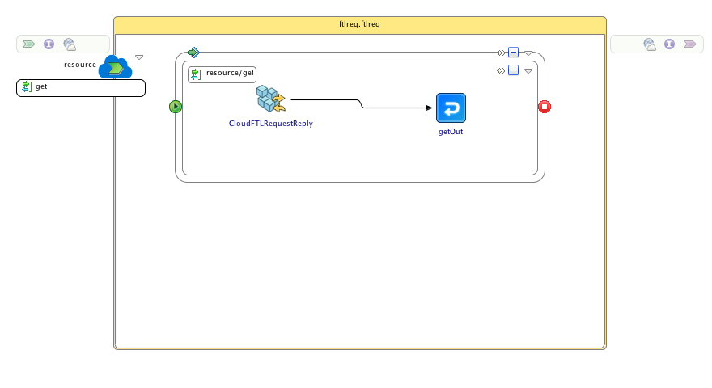
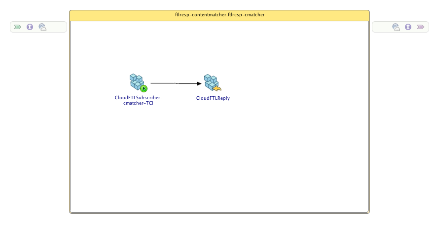

# TIBCO Cloud Integration Sample for Cloud FTL
## Synopsis
These two projects are a sample of how to use the Cloud FTL feature of TIBCO Cloud Integration.

## Process Diagram
There are two projects in this sample that work together to demonstrate the use of the Cloud FTL feature. The first project, `FTLReq Application`, has a process with a CLoudFTLRequestReply activity exposed as a REST service which has a GET method that takes 'reqmsg' as input which is published as a request message by CLoudFTLRequestReply activity
The process diagram in TIBCO Business Studio - Cloud Edition contains two activities:
* CloudFTLRequestReply: This activity sends a message to all other applications in the sandbox and waits for a response
* getOut: An activity that returns information as a response to the request that was received

The second project, `FTLResp-ContentMatcher`, has a process with a CloudFTLSubscriber activity and a CloudFTLReply activity for that subscriber. The activity `CloudFTLSubscriber-cmatcher-TCI` is configured with a content matcher set to "TCI", which means that this subscriber gets the message only when the incoming message is "TCI" and it will not be able to get any other messages
The process diagram in TIBCO Business Studio - Cloud Edition contains two activities:
* CloudFTLSubscriber-cmatcher-TCI: This activity listens for messages that match a specified content
* CloudFTLReply: An activity that returns information as a response to the request that was received. 

The message that subscriber gets is mapped to the `CloudFTLReply` activity and is returned as the response to the CLoudFTLRequestReply in FTLReq prohect which is then returned as a response to the REST call

## Installation
Download or clone this repository onto your local machine and import the projects into an existing TIBCO Business Studio - Cloud Edition workspace.

## Deployment
To run these applications you need to deploy them to the TIBCO Cloud Integration runtime.

To deploy the application to TIBCO Cloud Integration and test it from there follow the below steps:
* Right-click on the project **FTLReq.application** and select the option **Push to Cloud...**
* Right-click on the project **FTLResp-ContentMatcher.application** and select the option **Push to Cloud...**
* Open a browser and go to `http://cloud.tibco.com` and click **sign in**
* As soon as the application is started (shown by the **green** light in front of the application name) click on **Endpoint > VIEW API**
* Open the **GET** operation and provide a value for _Item_ and click **Try it out!**

## Question on this sample?
Feel free to open a Github issue or ask a question on the [TIBCO Community](https://community.tibco.com)

## Contributors
[Leon Stigter](https://github.com/retgits)

## License
Copyright © 2017 TIBCO Software Inc. All Rights Reserved.
Redistribution and use in source and binary forms, with or without modification, are permitted provided that the following conditions are met:

1. Redistributions of source code must retain the above copyright notice, this list of conditions and the following disclaimer.

2. Redistributions in binary form must reproduce the above copyright notice, this list of conditions and the following disclaimer in the documentation and/or other materials provided with the distribution.

3. Neither the name of TIBCO Software Inc.  nor the names of any contributors may  be used to endorse or promote products derived from this software without specific prior written permission.

THIS SOFTWARE IS PROVIDED BY THE COPYRIGHT OWNER AND CONTRIBUTORS  "AS IS" AND ANY EXPRESS OR IMPLIED WARRANTIES, INCLUDING, BUT NOT LIMITED TO, THE IMPLIED WARRANTIES OF MERCHANTABILITY AND FITNESS FOR A PARTICULAR PURPOSE ARE DISCLAIMED. IN NO EVENT SHALL THE COPYRIGHT OWNER OR CONTRIBUTORS BE LIABLE FOR ANY DIRECT, INDIRECT, INCIDENTAL, SPECIAL, EXEMPLARY, OR CONSEQUENTIAL DAMAGES (INCLUDING, BUT NOT LIMITED TO, PROCUREMENT OF SUBSTITUTE GOODS OR SERVICES; LOSS OF USE, DATA, OR PROFITS; OR BUSINESS INTERRUPTION) HOWEVER CAUSED AND ON ANY THEORY OF LIABILITY, WHETHER IN CONTRACT, STRICT LIABILITY, OR TORT (INCLUDING NEGLIGENCE OR OTHERWISE) ARISING IN ANY WAY OUT OF THE USE OF THIS SOFTWARE, EVEN IF ADVISED OF THE POSSIBILITY OF SUCH DAMAGE.