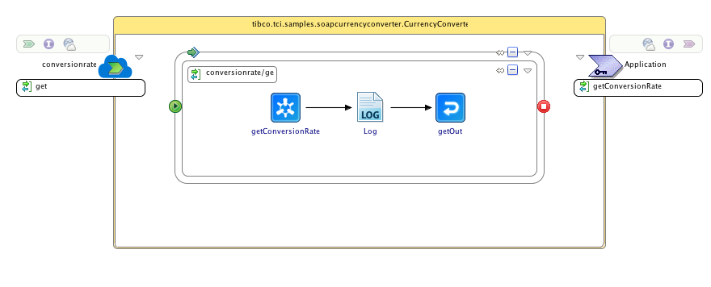

# TIBCO Cloud Integration Sample to invoke an external SOAP service
## Synopsis
This project is a sample of how to use TIBCO Cloud Integration to invoke an external SOAP service.

## Process Diagram
The process diagram in TIBCO Business Studio - Cloud Edition contains three activities:
* getConversionRate: This activity calls the external SOAP service and returns the response
* Log: An activity that logs information to the console or to the TIBCO Cloud Integration logs
* getOut: An activity that returns information as a response to the request that was received

## Installation
Download or clone this repository onto your local machine and import the project into an existing TIBCO Business Studio - Cloud Edition workspace. The external SOAP service is built using Python and can be run on any type of operating system that runs Python. The folder `soapserver` contains the `soapserver.py` file which acts as the server and runs on port `1884`. To run the server execute the following two commands:
* `pip install -r requirements.txt`
* `python soapserver.py`

_Note: do make sure that `HttpClientResource.httpClientResource` with the correct hostname and portnumber for your soapserver.py instance_

## Deployment
There are two options to run this application. You can either debug this application using TIBCO Business Studio - Cloud Edition or deploy this application to the TIBCO Cloud Integration runtime.

### Debug using TIBCO Business Studio - Cloud Edition
To debug this application in TIBCO Business Studio - Cloud Edition follow the below steps:
* Click **Run > Debug Configurations**.
* At the left hand tree of Debug Configuration wizard, expand **BusinessWorks Application** and select **BWApplication**.
* Click the **Applications** tab and then click the **Deselect All** button if you have multiple applications. Select the check box next to **tibco.tci.samples.soapcurrencyconverter.application**.
* Click **Debug**. This will run the sample in Debug mode.
* After the console displays the message **Started BW Application [tibco.tci.samples.soapcurrencyconverter.application:1.0]** open a browser and go to `http://localhost:7777/tibco.tci.samples.soapcurrencyconverter.application/`
* Open the **GET** operation and provide values for _fromcurrency_ and _tocurrency_ and click **Try it out!**
* After the application is finished it will display a _Response Body_ (e.g. **{ "conversionDate": "2016-05-20", "toCurrency": "EUR", "fromCurrency": "USD", "conversionRate": "0.89135" }**) and a _Response Code_ (e.g. **200**). The console in TIBCO Business Studio - Cloud Edition will display a line like **c.t.b.p.g.L.t.t.s.s.Log - The conversion rate between USD and EUR for today is 0.89135**

### Run using TIBCO Cloud Integration
To deploy the application to TIBCO Cloud Integration and test it from there follow the below steps:
* Right-click on the project **tibco.tci.samples.soapcurrencyconverter.application** and select the option **Push to Cloud...**
* Open a browser and go to `http://cloud.tibco.com` and click **sign in**
* As soon as the application is started (shown by the **green** light in front of the application name) click on **Endpoint > VIEW API**
* Open the **GET** operation and provide values for _fromcurrency_ and _tocurrency_ and click **Try it out!**
* After the application is finished it will display a _Response Body_ (e.g. **{ "conversionDate": "2016-05-20", "toCurrency": "EUR", "fromCurrency": "USD", "conversionRate": "0.89135" }**) and a _Response Code_ (e.g. **200**).
* The **log** tab in the **application details** section will display a line like **c.t.b.p.g.L.t.t.s.s.Log - The conversion rate between USD and EUR for today is 0.89135**

## Question on this sample?
Feel free to open a Github issue or ask a question on the [TIBCO Community](https://community.tibco.com)

## Contributors
[Leon Stigter](https://github.com/retgits)

## License
Copyright (c) 2016, TIBCO Software Inc.
All rights reserved.

Redistribution and use in source and binary forms, with or without
modification, are permitted provided that the following conditions are
met:

--Redistributions of source code must retain the above copyright notice,
this list of conditions and the following disclaimer.

--Redistributions in binary form must reproduce the above copyright
notice, this list of conditions and the following disclaimer in the
documentation and/or other materials provided with the distribution.

--The name of TIBCO Software Inc. may not be used to endorse or promote
products derived from this software without specific prior written
permission of TIBCO Software Inc.

THIS SOFTWARE IS PROVIDED BY THE COPYRIGHT HOLDERS AND CONTRIBUTORS "AS
IS" AND ANY EXPRESS OR IMPLIED WARRANTIES, INCLUDING, BUT NOT LIMITED TO,
THE IMPLIED WARRANTIES OF MERCHANTABILITY AND FITNESS FOR A PARTICULAR
PURPOSE ARE DISCLAIMED. IN NO EVENT SHALL THE COPYRIGHT OWNER OR
CONTRIBUTORS BE LIABLE FOR ANY DIRECT, INDIRECT, INCIDENTAL, SPECIAL,
EXEMPLARY, OR CONSEQUENTIAL DAMAGES (INCLUDING, BUT NOT LIMITED TO,
PROCUREMENT OF SUBSTITUTE GOODS OR SERVICES; LOSS OF USE, DATA, OR
PROFITS; OR BUSINESS INTERRUPTION) HOWEVER CAUSED AND ON ANY THEORY OF
LIABILITY, WHETHER IN CONTRACT, STRICT LIABILITY, OR TORT (INCLUDING
NEGLIGENCE OR OTHERWISE) ARISING IN ANY WAY OUT OF THE USE OF THIS
SOFTWARE, EVEN IF ADVISED OF THE POSSIBILITY OF SUCH DAMAGE.
